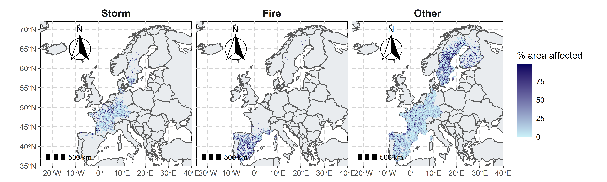
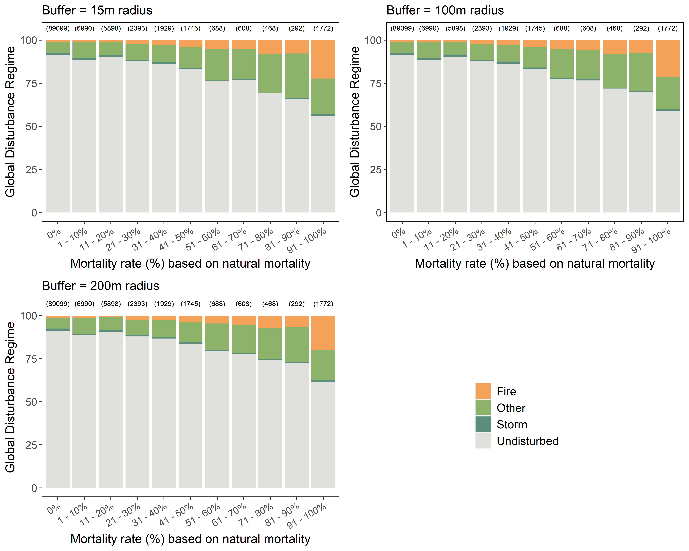
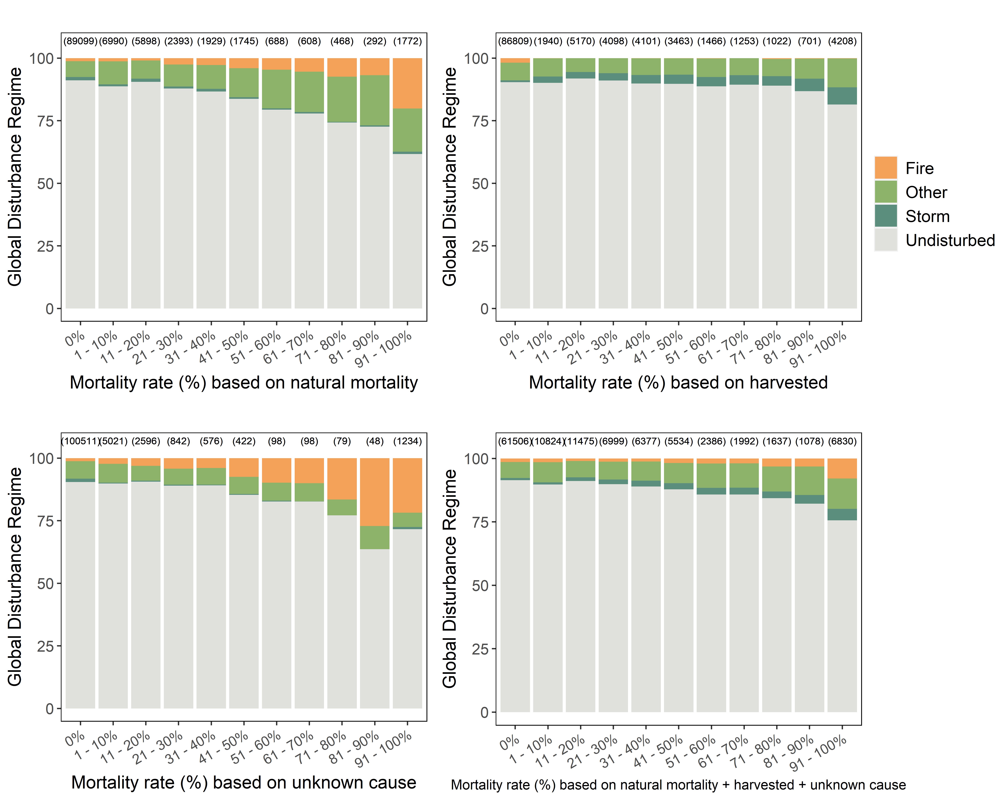

# Packages and set up

We start by loading the required packages. `targets` must be version 0.5.0.9000 or above. 


```r
require(c("dplyr", "ggplot2", "targets", "tidyr", "RColorBrewer", "lme4",
          "data.table", "knitr", "stringr", "measurements", "sf", "raster",
          "rgdal", "exactextractr", "rgeos", "rnaturalearth", "rnaturalearthdata", 
          "ggspatial", "cowplot"))
```

Second, we call the `targets` library. The `tar_unscript()` R function removes the `_targets_r` directory previously written by non-interactive runs of the report. It prevents the pipeline from containing superfluous targets.


```r
library(targets)
tar_unscript()
```

# Globals

We define some global options/functions common to all targets, and load the functions located in the R directory of the repository. 


```r
options(tidyverse.quiet = TRUE)
source("R/functions_data.R")
source("R/functions_plot.R")
tar_option_set(packages = c("dplyr", "ggplot2", "targets", "tidyr",
                            "RColorBrewer", "lme4","data.table", "knitr",
                            "stringr", "measurements", "sf", "raster",
                            "rgdal", "exactextractr", "rgeos", "rnaturalearth",
                            "rnaturalearthdata", "ggspatial", "cowplot"))
#> Establish _targets.R and _targets_r/globals/example-globals.R.
```


# Importation of french NFI data

We start by importing the following data on: 

- NFI plots (`NFI_plot`) and associated ecological data (`NFI_ecological_data`) and elevation (`NFI_plot_elevation`)
- NFI individual trees that were either alive (`NFI_tree_alive`) or dead (`NFI_tree_dead`) 
- NFI plots remeasured (`NFI_plot_remeasure`) 
- Individual trees remeasured that were either alive  (`NFI_tree_alive_remeasure`) or dead (`NFI_tree_dead_remeasure`) at first measurement. 


```r
list(
  tar_target(NFI_plot, read_plot(path = "data/FrenchNFI")), 
  tar_target(NFI_plot_elevation, read.csv("data/FrenchNFI/elevation_NFIplots.csv", sep = ";")),
  tar_target(NFI_ecological_data, read_ecological_data(path = "data/FrenchNFI")),
  tar_target(NFI_tree_alive, read_tree(path = "data/FrenchNFI")), 
  tar_target(NFI_tree_dead, read_dead_tree(path = "data/FrenchNFI")), 
  tar_target(NFI_plot_remeasure, read_reameasure_plot(path = "data/FrenchNFI_remeasure")), 
  tar_target(NFI_tree_alive_remeasure, read.csv("data/donnees_arbres_retour/foret_c135.csv", sep = ";")), 
  tar_target(NFI_tree_dead_remeasure, read.csv("data/donnees_arbres_retour/foret_morts.csv", sep = ";"))
)

#> Establish _targets.R and _targets_r/targets/import-NFI-data.R.
```

Second, we merge : 

* the data on alive and dead trees to obtain `NFI_tree`
* the remeasures of previously alive and dead trees to obtain `NFI_tree_remeasured`.


```r
list(
  tar_target(NFI_tree, merge_dead_alive(NFI_tree_alive, NFI_tree_dead)),
  tar_target(NFI_tree_remeasured, 
             merge_NFI_remeasured(NFI_tree_alive_remeasure, NFI_tree_dead_remeasure))
)
#> Establish _targets.R and _targets_r/targets/NFI_tree_join.R.
```


# Formating of French NFI data for the TreeMort project

## Species data

We start by importing :

* The existing species table in the NFI directory (`NFI_species`).
* A correspondence table linking genus and families. This table was built from the NCBI Taxonomy database ([Federhen 2012](https://doi.org/10.1093/nar/gkr1178)).


```r
list(
  tar_target(NFI_species, read.csv("data/FrenchNFI/species.csv", sep = ",")), 
  tar_target(NFI_genus_species_correspondence, read.csv("data/TreeMort/correspondanceGenusFamilyNFI.csv", sep = ";"))
)
#> Establish _targets.R and _targets_r/targets/import-species-NFI.R.
```

Using these two tables, we create a species table that matches TreeMort template (`TreeMort_species`), and write this table in the TreeMort directory. 


```r
tar_target(TreeMort_species, Format_species_TreeMort(NFI_species, NFI_genus_species_correspondence))
#> Establish _targets.R and _targets_r/targets/format-species-NFI-to-TreeMort.R.
```


## Trees data

We start by formatting the table of the first (census 1) and second (census 2) measurements (both dead and alive trees).


```r
list(
  tar_target(TreeMort_tree_census1, Format_trees_census1_TreeMort(NFI_tree, TreeMort_species)),
  tar_target(TreeMort_tree_census2, Format_trees_census2_TreeMort(NFI_tree_remeasured, TreeMort_tree_census1))
)
#> Establish _targets.R and _targets_r/targets/format-trees-NFI-to-TreeMort-by-census.R.
```

We merge these two dataframes to obtain the complete tree NFI dataset formatted for TreeMort (`TreeMort_tree`), that we write in the TreeMort directory. 


```r
tar_target(TreeMort_tree, 
           rbind(subset(TreeMort_tree_census1, 
                        tree.id %in% TreeMort_tree_census2$tree.id),
                 TreeMort_tree_census2))
#> Establish _targets.R and _targets_r/targets/format-trees-NFI-to-TreeMort.R.
```

## Plots data

We format the `NFI_plot` table to fit into TreeMort template, and we write the formated table (`TreeMort_plot`) in the TreeMort directory.


```r
list(
  tar_target(NFI_stand_age, Compute_NFI_stand_age(NFI_tree)), 
  tar_target(TreeMort_plot, Format_plots_TreeMort(NFI_plot, NFI_ecological_data, NFI_plot_elevation, NFI_stand_age))
)
#> Establish _targets.R and _targets_r/targets/format-plots-NFI-to-TreeMort.R.
```


## Census data

First, we need to create a management variable describing the occurence of a cut in the last 5 years for each census. 


```r
tar_target(NFI_census_management, compute_management_census(NFI_plot, NFI_plot_remeasure))
#> Establish _targets.R and _targets_r/targets/create-management-census.R.
```

We format the `TreeMort_tree` table to create a census table fitting TreeMort template, and we write the formated table (`TreeMort_census`) in the TreeMort directory.


```r
tar_target(TreeMort_census, Format_census_TreeMort(TreeMort_tree, NFI_census_management))
#> Establish _targets.R and _targets_r/targets/format-census-TreeMort.R.
```

## Meta data

We write a metadata table in the TreeMort directory to specify important information on some columns. 


```r
tar_target(TreeMort_metadata, Meta_data_TreeMort())
#> Establish _targets.R and _targets_r/targets/metadata-TreeMort.R.
```

# Importation and formating of FUNDIV data

## Importation

We start by importing the different datatables of FUNDIV in their original format. 

```r
list(
  tar_target(FUNDIV_tree_original_NoFR, read.csv(file.path("data/FUNDIV", "FunDiv_trees_Nadja.csv"),
                                                 stringsAsFactors=FALSE) %>% dplyr::filter(country != "FG")),
  tar_target(FUNDIV_species, read.csv(file.path("data/FUNDIV", "FunDiv_species_Nadja.csv"),
                                     stringsAsFactors=FALSE, fileEncoding = "cp1252")), 
  tar_target(FUNDIV_plots_original_noFR, read.csv(file.path("data/FUNDIV", "FunDiv_plots_Nadja.csv"),
                                                  stringsAsFactors=FALSE) %>% dplyr::filter(country != "FG")),
  tar_target(FUNDIV_climate, read.csv(file.path("data/FUNDIV", "FunDiv_plots_climate_sapropos.csv"),
                                      stringsAsFactors=FALSE)),
  tar_target(FUNDIV_management, read.csv(file.path("data/FUNDIV", "FunDivEUROPE_plot_management.csv"),
                                      stringsAsFactors=FALSE))
)
#> Establish _targets.R and _targets_r/targets/import-FUNDIV.R.
```

## Inclusion of French NFI remeasured data

Using French NFI data formatted for TreeMort, we format the French tree data with true mortality observations to FUNDIV template. 


```r
tar_target(FUNDIV_tree_original_FR, Format_trees_TreeMort_to_FUNDIV(TreeMort_tree, FUNDIV_species))
#> Establish _targets.R and _targets_r/targets/format-trees-TreeMort-to-FUNDIV.R.
```

We do the same with the french plot data: 


```r
tar_target(FUNDIV_plots_original_FR, 
           Format_plots_TreeMort_to_FUNDIV(NFI_ecological_data, TreeMort_plot, FUNDIV_tree_original_FR))
#> Establish _targets.R and _targets_r/targets/format-plots-TreeMort-to-FUNDIV.R.
```

Lastly, we can replace the datasets with and without french data for trees and plots. We also apply a small correction to the weight in the tree table


```r
list(
  tar_target(FUNDIV_tree_original, 
             correct_weight_FUNDIV(rbind(FUNDIV_tree_original_NoFR, FUNDIV_tree_original_FR))), 
  tar_target(FUNDIV_plots_original, 
             rbind(FUNDIV_plots_original_noFR, FUNDIV_plots_original_FR))
)
#> Establish _targets.R and _targets_r/targets/merge-FrenchNFI-FUNDIV.R.
```

We format the original FUNDIV data to better fit the IPM (and to include climatic variables). 


```r
tar_target(FUNDIV_tree, 
           read_FUNDIV_tree_data(FUNDIV_tree_original, FUNDIV_plots_original, FUNDIV_species, 
                              FUNDIV_climate, FUNDIV_management, remove_harv = F))
#> Establish _targets.R and _targets_r/targets/format-IPM-FUNDIV.R.
```

## Formating to Finnish NFI template

The Finnish NFI template is slightly different from the French NFI template or FUNDIV template. Therefore, we need to format them. 


```r
tar_target(FinnishNFI_French_tree, 
           Format_trees_FUNDIV_to_FinnishNFI(subset(FUNDIV_tree, country == "FR"), NFI_tree, 
                                              NFI_plot_elevation, NFI_plot_remeasure, 
                                              NFI_ecological_data))
#> Establish _targets.R and _targets_r/targets/format-FUNDIV-to-FinnishNFI.R.
```

We write a metadata table in the FinnishNFI directory to specify important information on some columns. 


```r
tar_target(FinnishNFI_metadata, Meta_data_FinnishNFI())
#> Establish _targets.R and _targets_r/targets/metadata-FinnishNFI.R.
```


## Inclusion of disturbance data in FUNDIV

We create a circular buffer around each FUNDIV plot center, and we associate each plot to the percentage of the buffer area covered by each type of disturbance ([Senf & Seidl, 2021a](https://doi.org/10.1111/gcb.15679)) that occured between 1986 and 2020. We use three size of circular buffer: 15m, 100m and 200m: 


```r
list(tar_target(disturbance_per_plot_15m, 
           Get_disturbance_per_plot(15, FUNDIV_tree, "data/Disturbance")), 
     tar_target(disturbance_per_plot_100m, 
           Get_disturbance_per_plot(100, FUNDIV_tree, "data/Disturbance")), 
     tar_target(disturbance_per_plot_200m, 
           Get_disturbance_per_plot(200, FUNDIV_tree, "data/Disturbance")))
#> Establish _targets.R and _targets_r/targets/import-disturbance-Senf-areaPercentage.R.
```

Secondly, we add this information in the FUNDIV database.


```r
list(tar_target(FUNDIV_tree_disturbance15m, 
           add_disturbance_to_FUNDIV(FUNDIV_tree, disturbance_per_plot_15m)), 
     tar_target(FUNDIV_tree_disturbance100m, 
           add_disturbance_to_FUNDIV(FUNDIV_tree, disturbance_per_plot_100m)), 
     tar_target(FUNDIV_tree_disturbance200m, 
           add_disturbance_to_FUNDIV(FUNDIV_tree, disturbance_per_plot_200m)))
#> Establish _targets.R and _targets_r/targets/add-Senf-areaPercentage-to-FUNDIV.R.
```

The code below extracts the prevalence (% of buffer area of all plots covered) of each disturbance type per country and per year, in order to monitor temporal variations in disturbance regimes. 


```r
tar_target(prevalence_per_country_per_year, 
           get_annualPrevalence(disturbance_per_plot_200m, FUNDIV_tree))
#> Establish _targets.R and _targets_r/targets/get-disturbance-prevalence-per-country-and-year.R.
```


Extraction of Agreste data on annual salvage logging volume in France (national level) from 2009 to 2019. 


```r
tar_target(data_agreste, import_agreste("data/Agreste/agreste_total.csv"))
#> Establish _targets.R and _targets_r/targets/get-agreste-data.R.
```


# Make all plots, run pipeline and write tables


```r
list(
  tar_target(Map_areaCoveredPerDisturbance_FUNDIVplots, 
           Map_FUNDIVplots_areaCoveredPerDisturbance(FUNDIV_tree_disturbance100m)), 
  tar_target(plot_Compare_NFI_Senf_disturbance_area, 
           Compare_NFI_Senf_disturbance_area(FUNDIV_tree_disturbance100m, NFI_plot_remeasure)), 
  tar_target(plot_prevalence_per_country_per_year, 
           plot_annualPrevalence(prevalence_per_country_per_year)), 
  tar_target(plot_disturbedArea_perMortalityRate_15m, 
           plot_areaDisturbance_perMortalityRate(FUNDIV_tree_disturbance15m, 
                                                 "Buffer = 15m radius", 
                                                 death.in = "natural mortality")), 
  tar_target(plot_disturbedArea_perMortalityRate_100m, 
           plot_areaDisturbance_perMortalityRate(FUNDIV_tree_disturbance100m, 
                                                 "Buffer = 100m radius", 
                                                 death.in = "natural mortality")), 
  tar_target(plot_disturbedArea_perMortalityRate_200m, 
           plot_areaDisturbance_perMortalityRate(FUNDIV_tree_disturbance200m, 
                                                 "Buffer = 200m radius", 
                                                 death.in = "natural mortality")), 
  tar_target(plot_disturbedArea_perMortalityRate_200m_harvest, 
           plot_areaDisturbance_perMortalityRate(FUNDIV_tree_disturbance200m, "", 
                                                 death.in = "harvested")), 
  tar_target(plot_disturbedArea_perMortalityRate_200m_unknown, 
           plot_areaDisturbance_perMortalityRate(FUNDIV_tree_disturbance200m, "", 
                                                 death.in = "unknown cause")), 
  tar_target(plot_disturbedArea_perMortalityRate_200m_alldeath, 
           plot_areaDisturbance_perMortalityRate(FUNDIV_tree_disturbance200m, "", 
                                                 death.in = c("natural mortality", "harvested", "unknown cause"))), 
  tar_target(plot_agreste_against_disturbance, 
             plot_agreste_disturbance(prevalence_per_country_per_year, data_agreste)), 
  tar_target(plot_compare_mortality_tree_plot_level, 
             plot_mortality_tree_plot(NFI_tree_alive_remeasure, NFI_plot_remeasure)),
  tar_target(plot_probability_to_be_harvested, 
             plot_harvest_probability(NFI_tree_alive_remeasure, NFI_plot_remeasure, NFI_tree_alive)),
  tar_target(plot_probability_to_be_harvested2, 
             plot_harvest_probability2(NFI_tree_alive_remeasure, NFI_plot_remeasure, NFI_tree_alive))
  
)
#> Establish _targets.R and _targets_r/targets/make-all-plots.R.
```


```r
tar_make()
```


```r
write.table(tar_read(TreeMort_species), 
          file = "data/TreeMort/spp_data.csv", row.names = F)
write.table(tar_read(TreeMort_tree), 
          file = "data/TreeMort/tree_data.csv", row.names = F)
write.table(tar_read(TreeMort_plot), 
          file = "data/TreeMort/plot_data.csv", row.names = F)
write.table(tar_read(TreeMort_census), 
          file = "data/TreeMort/census_data.csv", row.names = F)
write.table(tar_read(TreeMort_metadata), 
          file = "data/TreeMort/meta_data.csv", row.names = F)
write.table(tar_read(FUNDIV_tree_original), 
          file = "data/FUNDIV/outputs/FUNDIV_tree_original.csv", row.names = F)
write.table(tar_read(FUNDIV_plots_original), 
          file = "data/FUNDIV/outputs/FUNDIV_plots_original.csv", row.names = F)
write.table(tar_read(FinnishNFI_French_tree), 
          file = "data/FinnishNFI/FinnishNFI_French_tree.csv", row.names = F)
write.table(tar_read(FinnishNFI_metadata), 
          file = "data/FinnishNFI/FinnishNFI_meta_data.csv", row.names = F)
```

# Data exploration - Disturbance data and FUNDIV

We plot the percentage of the buffer around each plot covered by the three types of disturbance. 

```r
tar_read(Map_areaCoveredPerDisturbance_FUNDIVplots)
#> Scale on map varies by more than 10%, scale bar may be inaccurate
#> Scale on map varies by more than 10%, scale bar may be inaccurate
#> Scale on map varies by more than 10%, scale bar may be inaccurate
```




In the plot below, we compute from the dataset `disturbance_per_plot_200m` the percentage of the buffer area affected by each disturbance for each year and each country, and show this temporal and spatial variability. We also added the year of first and last measurement for each country (vertical dotted black lines). 


```r
tar_read(plot_prevalence_per_country_per_year)
```


Using Agreste data, we have access to the annual volume of salvage logging in France from 2009 to 2019. The plot below compares this volume of salvage logging with annual prevalence for the same period. 


```r
tar_read(plot_agreste_against_disturbance)
```


To make the plots below, we computed the mortality rate of each plot (harvested trees and recruits were removed), converted it into a qualitative variable and we computed for each class the percentage of area covered by each type of disturbance. We make one plot per buffer size.  


```r
cowplot::plot_grid(tar_read(plot_disturbedArea_perMortalityRate_15m) + 
                     ggplot2::theme(legend.position = "none"), 
          tar_read(plot_disturbedArea_perMortalityRate_100m) + 
            ggplot2::theme(legend.position = "none"), 
          tar_read(plot_disturbedArea_perMortalityRate_200m) + 
            ggplot2::theme(legend.position = "none"), 
          cowplot::get_legend(tar_read(plot_disturbedArea_perMortalityRate_200m)), 
          align = c("h", "v"), nrow = 2)
#> Warning: Graphs cannot be horizontally aligned unless the axis parameter is set.
#> Placing graphs unaligned.
```



In the 3 plots above, we only considered natural mortality when calculating mortality rates (harvested trees, or trees that died of unknown causes were removed from the dataset). In the three plots below, we show the same figure than above (with 200m-radius buffer), but with different approaches to calculate the mortality rates (with harvest only, unknown cause only, or all cause of death confounded)


```r
cowplot::plot_grid(
  tar_read(plot_disturbedArea_perMortalityRate_200m) + ggplot2::theme(legend.position = "none") + 
    ggplot2::ggtitle(""), 
  tar_read(plot_disturbedArea_perMortalityRate_200m_harvest) + ggplot2::theme(legend.position = "none"), 
  cowplot::get_legend(tar_read(plot_disturbedArea_perMortalityRate_200m_alldeath)), 
  tar_read(plot_disturbedArea_perMortalityRate_200m_unknown) + ggplot2::theme(legend.position = "none"), 
  tar_read(plot_disturbedArea_perMortalityRate_200m_alldeath) + 
    ggplot2::theme(legend.position = "none", axis.title.x = ggplot2::element_text(size = 10)), 
  rel_widths = c(1, 1, 0.3), nrow = 2)
```




# Data analysis - Disturbance data and FUNDIV

To take into account salvage logging in the survival model, we need to compute a probability to be harvested knowing that the tree is alive, or dead. To that end, we can use the estimation by NFI agents in France of the disturbance that occurred in the plot. First, we need to compare the mortality at plot level with real mortality at tree level, computed with two different approaches (with or without mortality rate).  


```r
tar_read(plot_compare_mortality_tree_plot_level)
```


Mortality rate at the tree level matches mortality at the plot level when it is computed with the harvest rate. From this result, we can assume that in a plot affected by a disturbance, all trees that were harvested were dead before to be harvested. In the case of undisturbed, it is not possible to know whether harvested trees experienced background mortality before, or were alive. Therefore, we need to make the assumption that trees that died from background mortality have the same probability to be harvested than alive trees. 

Based on these assumptions, we modeled the harvest probability with a simple binomial glm with a logit link function as a function of the status (alive or dead due to disturbance or background mortality) and of the dbh at census 1. 


```r
tar_read(plot_probability_to_be_harvested)
```


```r
tar_read(plot_probability_to_be_harvested2)
```


